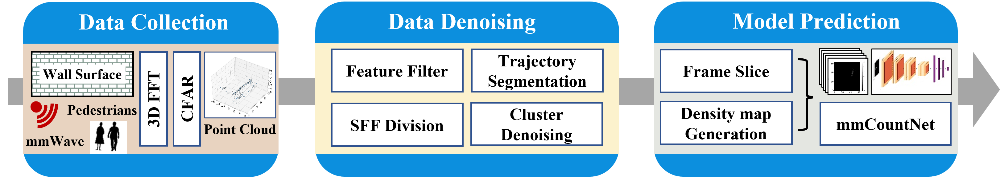

# 基于毫米波的行人统计研究
Research on Pedestrain Counting Based on Millimeter Wave

#### 介绍
本项目为基于毫米波的行人统计算法研究，将毫米波雷达技术于行人统计联系起来，同时引入卷积神经网络模型，可以有效识别离散型、小流量的行人数据。

#### 软件架构
本项目主要包含数据采集、数据去噪、行人预测三阶段：

1.  preprocessor.py：包含对点云数据进行预处理的各种函数的库
2.  mmCountNet.py：卷积神经网络分类器具体实现
3.  visualizer.py：包含算法各流程的可视化方法的库
4.  main.py：主函数

此外，项目中的其他文件说明如下：

5.  IMG：系统流程图
6.  PYCORE_FILE：pycore库，实现模型mmCountNet的可视化
7.  TI_FILE：TI公司发布的解析雷达数据的库

#### 安装教程
本项目的环境为：

8.  系统：Win10操作系统 8G内存
9.  IDE：Pycharm Community
10.  python：3.8.12
11.  pytorch：1.11
12.  数据链接： [Google Drive](https://drive.google.com/file/d/1Pffh4tY6TkU9WW-IsesNasN4GnySoDNa/view)

#### 系统流程

#### 具体详见

